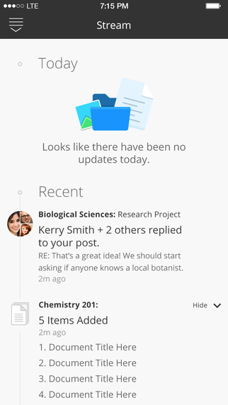

A week back, my colleague [Craig Wakefield](http://blogs.brighton.ac.uk/cw115/2014/12/08/london-blackboard-user-group/ "Craig Wakefield Blog - related post!") sent news that Blackboard had released a new student-focused app for iOS and Android: _Bb Student_. At this point we do not know where _Bb Student_ will fit within the Blackboard app ecosystem that also includes: [_Blackboard Mobile Learn_](https://itunes.apple.com/gb/app/blackboard-mobile-learn/id376413870?mt=8 "Blackboard Mobile Learn"), [_Bb Polls_](https://itunes.apple.com/gb/app/polls-by-blackboard/id722551092?mt=8 "Bb Polls app") and then the staff-facing [_Bb Grader_](http://www.blackboard.com/bbgrader "Bb Grader at the Blackboard Site").   The shiny new [_Bb Student_](https://itunes.apple.com/us/app/bb-student/id950424861?mt=8&uo=4 "Bb Student app on US App Store") app is currently only available in the US Apple App Store, however I just happen to have a US Apple App Store account (due to many happy years of residency in that part of the world). So here are my initial thoughts on the app with a few caveats:

- It is early days for this app and I believe that it is a Beta, [see the Blackboard labs site for more details](http://www.blackboard.com/sites/labs/)
- This app bears a strong relationship to the User Interface (UI) and structural changes which are to come as part of the Ultra release. This release will not be available for a while (estimated 2016) and even when it is, it may take a while for institutions to move to that version due to the complete re-design planned for the UI.
    - [Here is a nice visual preview of Ultra from Eric Silva in case you are interested](http://blog.ericsilva.me/blackboard/learn/blackboard-learn-screenshots/).
    - [Here are the webinar recordings from Blackboard showcasing Ultra](http://webinars.blackboard.com/UXSneakPeekRecording)
- Finally these are just my initial observations and I fully acknowledge that there may be structural and terminology changes prior to a release of the app in the UK. Also as the app is a Beta, I accept that changes and updates may currently be in the works to improve functionality.

## Information Design and Structure

This app is designed for a smartphone screen size and has an immediacy to the presentation of information which I like. Upon opening the app you would[^1] be confronted by the useful, just-in-time information in your _Stream._ Your _Stream_ would aggregate course and module activity and replies to your blog/wiki/discussion board posts. This is somewhat similar to the updates aggregated within the [Global Navigation](http://blogs.brighton.ac.uk/elearning/2014/06/09/whats-new-in-studentcentral/ "Global Navigation and other updates in April 2014") (April 2014 version of Blackboard). A downwards sweep with a finger reveals that the structure of this app is very simple; you can access your _Stream_ or your _Courses_ and there are no other complications. Well almost...there is a cog icon to indicate settings options, but at this point there is nothing to access in that area and a feedback area for entry of a contact email address.

### Courses

At the top of the Courses area there is a large header stating the word "Current", this suggests that at some point the app will distinguish between the current term, or current modules/courses being studied and past modules/courses. We cannot see that distinction within the app yet, but this is a promising development as a means to help signpost students to the correct information. Each course is shown as a rectangular block, featuring a coloured strip, a title, the name of the _Professor\*_ (academic staff person) and a spot for their avatar ([avatar definition, see "4"](http://www.merriam-webster.com/dictionary/avatar "avatar definition")). There are a couple of potential issues with this, if you have more than one instructor assigned to an area then the area is listed as "Professor not yet assigned". Furthermore even in a module area when only one instructor was assigned and 'said' instructor had an avatar loaded within Blackboard, "Professor not yet assigned" is still shown on the Course block and the avatar is not picked up; only a black circle with a question mark on it is displayed. This speaks to two points, where is app looking to find avatars and does it have very specific requirements for compatible images? Also the use of roles within Blackboard may become more pertinent in future, this aligns with my experience of working with moodle in the US due to the [FERPA](http://www2.ed.gov/policy/gen/guid/fpco/ferpa/index.html "FERPA information") legislation which is akin to data protection and mandates whom can access coursework and grades etc. Use of access-based roles is important in order to comply with the rules outlined in FERPA. Pressing on a Course block takes you into that specific course/module area. Within the course area, the instructor name and image is shown at the top with resources immediately below, and this is where it gets interesting, most of your content areas will be ignored and in our case the app is only picking a content area which we label as "Study Materials" by default within all out modules. Furthermore if I look at a specific module within "Study Materials" I have the following content types: _items,_ these are not shown in the app; a _wiki,_ this is not shown within the app; and a _journal_, which is also not shown within the app. What is shown, are _folders, weblinks_, you can see a _test_ activity exists, but you cannot yet take it. I do think that the windowed in-app browser for viewing web pages is a step in the right direction, it includes back (<) and forward (>) arrows, a refresh and an option to copy the link or open it in the native OS web browser (iOS Safari). This is a marked improvement on how web pages display in the Blackboard Mobile Learn app in my opinion. Without more development related to the display of content items, I cannot comment further on those aspects of the app at this time. \*As shown in the screen shot below it looks like there would be a time and location in the course/module area as well. This briefly flickers up when loading but then disappears as that kind of data is not available in our instance of Blackboard.

## User Interface Design and User Experience

First of all, a few points about the UI. I think that it is pretty good although it does suffer from the same issue as the Blackboard Mobile Learn app, a bleach-white backdrop. However unlike the Blackboard Mobile Learn app you do not end up with a matryoshka doll effect, where the nesting levels can become very confusing. What I like about it is that when you are in a folder in this app, you are actually **in** that folder and you press an X to get out of it, and back up to the next level. This flattened structure where we essentially end up with one content area seems to correlate with what I have seen of Ultra. The new _folder_, _link_ and _course_ icon design is strong and easy to understand. The removal of the shadowing effects seen in the desktop version of Blackboard, in favour of simple vector graphics in the app is a good decision. The icons are even further simplified than the versions that we see in Blackboard Mobile Learn app, yet similar enough to give existing users a frame of reference. I do think that the choice of a stock-icon wireframe globe icon to represent the stream is a weak point. The _posts_ icon currently used in the Global Navigation would seem more evocative of a stream if we're talking icons (quite like an Aquarius star sign symbol, so that association makes sense). 

The navigation is probably my favourite aspect of the app. From the two options at the outset in the app home area, _Stream_ or _Courses,_ to the pile of your recently visited courses/modules gathered at the bottom of 'said' home area, there is a welcome level of simplicity. I also like the forethought put into multiple navigation paths, especially in terms of returning to the previous level of the app. So if you are in a course/module, you can sweep a finger down from the top and return to the course/module listings, another sweep down will take you to the home area. If that isn't intuitive, and for some it won't be, there is a "burger-style" menu (design~ "[burger](http://jvandenrym.me/2014/10/10/the-beefy-icon/ "Burger icon - Johan Van Dem Rym's Site")" or "club sandwich") on the top-left of every view that will take you back to the home area. What is particularly unique about the interface, is that in order to provide the user with confirmation of shifting levels, the bars which identify which level you are on give a satisfying jelly-like bounce when you use a finger to sweep upwards or downloads. The "burger" menu also has a bounce to it, a bit like your finger's pressure left an indent in it. Nice little design touches which add a bit of character to the app. Another good feature is the 
use of vibrant colour as an affirmation of touch selections in the grey/black home area.

## Suggestions for Improvement

- Allow users to change the background colour. Yes, white says clean and simple, but it presents accessibility issues for Dyslexic users. A plus on accessibility for font choice and sizing though!
- Bring in more content types soon please! I would love to see how a blog or discussion board will be shown in this app.
- Bring in some simple sorting to the course area. I see where we are going with the Ultra structure (only the current courses being shown) but the arbitrary colour stripes for each course seem like a step backwards. I think that users might expect the sorting and colour labelling available in Blackboard Mobile Learn app.

Overall I think that this app has a lot of potential, although it has quite a long way to go. I look forward to seeing how the functionality develops over the coming months. 

**Further Reading:** [Killing Off the Global Navigation: One Trend to Avoid](http://www.nngroup.com/articles/killing-global-navigation-one-trend-avoid/ "Nielsen Norman Group study") - study by Nielsen Norman Group

[^1]: Would = the stream is not loading on my version of the app. I am able to access my institutional materials in the Courses area, but our implementation of Blackboard is not configured for the stream at this time.