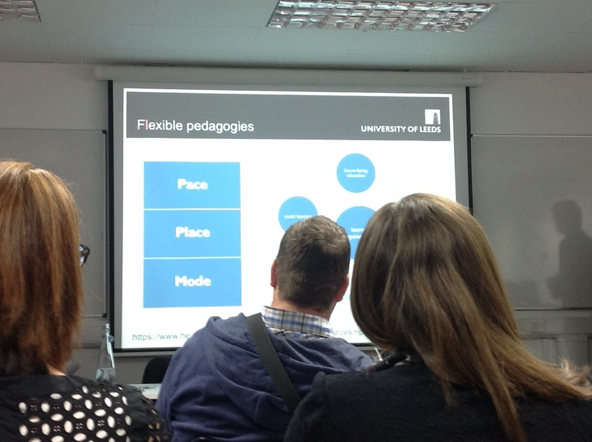
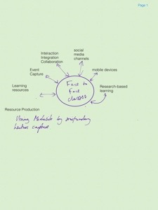

MobTecFurtherEd live blogging from the conference, which took place on the 29th of April, 2015 at University of Salford, Manchester. Typos and grammatical errors are inevitable.

## Introductory statement 

Martin Cope points to factors which have stood in the way of widespread adoption of mobile technologies in further and higher education. We have reached beyond the tipping point, folks in attendance have an array of titles related to eLearning, but there is still much networking and collaboration to be done. 

## First speaker: Jon Fowler 

Introducing the technology for use during the conference. We are using an app called Meetoo. Meetoo is a real-time messaging and poling app Can access from Apple, Android and HTML Web-based Like many applications of this flavour it requires a pin to join up to the session. He is running the "instructor/meeting lead" from his device. Real-time results much like poll everywhere. Has a nice free text function, which has the option to be moderated as well. 

## Dr Maren Deepwell Chief Executive Association for Learning Technology (ALT) 

**Policy, openness, learners, professionalisation and scale** 

- For the past 10 years, papers on Ed Tech the world will be changed by _x_ technology. But _y_ and _z_ challenges have meant that things have not changed all that much. 
- Discussion of policy in the making - FELTAG - Further Education Learning Technology Action Group [FELTAG site](http://feltag.org.uk) 
- ETAG - Education Technology Action Group Can we only be open about success? 
- Mention of the OER15 conference: [https://oer15.oerconf.org](https://oer15.oerconf.org) 
- Does what we want from learning and teaching actually change? Does the role of education change? 
- Is Learning Technology any different now from 5, 10, 15, 20 years ago? 

- Some of the developments in technology and the pace of change are hard to contend with 
- how can we keep pace? More collaboration will help. Why teach each other 
- Share between industry and sectors - Open - Sustainable - Empowered professionalism 
- Learning Technology for everyone 
- Internal research and collaboration Staff have a growing set of requirements for their own professional development. 
- Check out the #ocTEL course - this was an online course which ALT ran. Now available as an open resource We are part of an exciting time in learning technology! ALT [www.alt.ac.uk](http://www.alt.ac.uk) @A\_L\_T 

## Eli Wike Customer Success Manager accessplanit 

Small software development firm based in Lancaster. 

**Focus:** 
- Improving efficiencies and use of existing resources 
- Challenges - Case Studies - Customer Success 
- Case study 1: University of the Arts London International expansion - one system to replace several for automation of communication and emails 
- Case study 2: Salford Continuing Professional Development 
- Case study 3: University of West London Process music performance grade examinations - huge undertaking. Payment systems and processing automation. 
- Case study 4: Cambridge International Examinations - change of focus and internationalisation Continual change management - is the message 

## Jonny Driscoll Founder and CEO, Unipin 

- Driscoll came up with the concept of Unipin while he was at University. Noticed that there were lots of events at the university, but hardly anyone was in attendance. Refers in Simin Sinec talk on tech, talks about innovative tech. Mentions the Social Learning Model 
- Unipin is a social learning environment - engage students Personalised activities lists, modelled on Pinterest-like wireframing. 
- Student and staff focus Talking about the balance of academic and social experiences as being important to university life and experience. Group chat based around module structure. Can upload videos from mobile Has calendar and notification system and suggested events based upon the student's profiles. 
- Mention that they record their achievements in the system - a kind of portfolio at the end of their time at the university. The tool is aimed at student retention and getting students to attend events and taking part in uni-life and extracurricular clubs and societies. Also in-lecture reminders and note taking functionality. 
- Less than 10% of students respond to their emails - not an efficient way to communicate with students. 
- "The fastest way to change yourself is to hang out with people who are already the way you want to be" - Reid Hoffman of LinkedIn Taskbar - university tab. 
- Trying to make a seamless journey between social and learning aspects. Social data analysis is mentioned as well - learner journey - as a record of what you have worked on. Employers perspectives 
- Unipin has a record of what students have worked on. 
- Works across devices, tries to minimise distractions - logging into Moodle versus Unipin Challenge was, find yesterday's lecture notes: Moodle = 55s vs. Unipin = 15s 
- Returning to the idea of flow and chronology for presentation - [SEE earlier post about Bb Student app](/post/2015/02/uk-sneak-peak-review-bb-student-app/). 
- At University of Birmingham - 100,000 Facebook posts per day Has some dashboard functionality in terms of flagging "at risk" students to the instructor. They use Trello to gain insight and ideas from students. They are using student's devices to automate students' lecture attendance. 

## Neil Morris Director of Digital Learning Prof. of Educational Technology, Innovation and Change, School of Education University of Leeds 

- "...involve me and I learn" Ben Franklin quote Student expectations from use in primary school and high school. 
- HEA Academy - flexible pedagogies - pace, place, mode  
  
 
  
. Pedagogical underpinnings.")   
  
 

- Talking about Leeds' involvement in FutureLearn 
- Interesting post about a course in acting, namely biomechanics, a very physical method and how that could be successfully taught online. 
- Every lecture is 5mins long, scripted and highly produced - all produced as OERs Recommend the use of animations to aid conceptual understanding. 
- Essentially pointing towards to the importance of visualisation (unsurprisingly I am a big fan of that!) 
- MOOCs are nice but are not a strong recruitment tool - consideration of the profile of completers 
- Towards a Flipped Learning vision - mentions that lecture attendance has not been negatively impacted by flipped. 
- Findings will be published in a paper. 

## Dave Harrison Director and Co-Founder 10Eighty 

- Makes point about retention of material from lecture delivery. His point is classroom training doesn't embed learning Tying in points around social learning and employability. 
- How can we use technology to engage with students on an ongoing basis? Students are your brand ambassadors 
- The future of work: - mobile device is your office - learning in the workplace will be via video, games and simulations - networking is key - knowledge workers - corporate social networks 
- social media literate 

**But what is it?** 

- A leadership cloud - discussions, shared documents - part social media platform, part repository by the looks of things Crowd sourcing for project work as an exemplar use. 
- Talk of reverse mentoring in organisations and using the tool to support that. 

## Dr Aleksej Heinze Co-Director for Digital Business, Salford Business School University of Salford 

**Part of the centre for digital business Key points:** 
- using Moocs to enhance Salford's international presence Lessons from the past: 
- Students are more likely to enrol if they know us already 
- Highest sources of student registration conversions:

- Internet search engines
- University of Salford website
- Talk of Google Analytics 
- Why a MOOC? Search and Social Media Marketing for International business 
- MOOC Resources to help students engage with different online technologies.
-  They monitored which videos were most popular. Used Twitter, Dokeos, Slideshare and YouTube for delivery of their materials - Iversity is the new MOOC kid-on-the-block and Salford are working with them in future. 
- Businessculture.org site analytics were encouraging showing access of the new resource. 
- Key lessons - businessculture.org

- Strategic use of Search Engine Optimisation
- Content marketing is key for future student recruitment

## Jon Fowler From LUMI

- Talk of meetoo app Cloud-based system, very quickly able to produce a report. 
- Very nice looking spreadsheet analysis - this is something that meetoo seems to do well in comparison to some other systems 

- Audience comment: value in sentiment analysis rather than looking at individual responses. 
- Functionality coming out in the next release: Adding a discussion thread and the option to vote-up questions. 

## Martin Cope Innovative Teaching and Learning Specialist Chesterfield College Project based learning (PBL) Digital evidence capture & assessment. 

- Pro's & Cons Learning Outcomes

1. Recognise the role and skills required to utilise digital technology in the teaching learning environment
2. Preparation required for running a digitally enhanced curriculum
3. Consider your own/departments potential and the skill set required to run a digital curriculum
4. Recognise the need to gain knowledge and understanding of how digital resources support learning and promote independence.

Nice list of considerations! 

<---end of live blog---->
