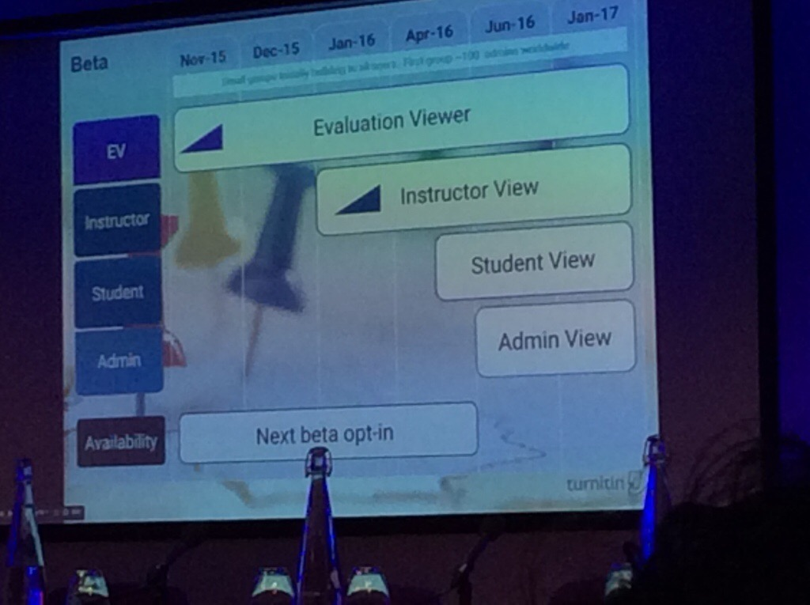

Gary Finnegan from Turnitin - he prioritises new features for the Blackboard plugins They have moved to an Agile, Scrum development and project management frameworks. They are taking apart the plugins at the moment and rebuilding, in order to make 

## Key issues

* Basic Account migration (self-managed hosting) 
* Email non-submitters feature wasn't working - now fixed since the slide was created 
* Reminder of the change to the URL post-Jisc so that means upgrade is necessary. 

## Turnitin Next

* NEXT will be installed over the top Turnitin Direct 
* There will be a way to migrate to next but it will be harder from Basic to Direct 
* Best to stay with what you have got as there will not be a way to migrate the data between the two. 
* Support will continue for plugins until everyone is migrated to Next. 

## Blackboard versions
* Supported: Learn 9.1 Self hosted (SP14 April and October) 
* Learn 9.1 Managed Hosted (SP14 April and October) 
* Working to support: Ultra, tricky due to lack of building blocks, however they are currently working with Blackboard. 
* Turnitin Next will have multiple marker function. Once they build multiple instructors into the core product then multiple instructions will be better in the iPad app. 
* Group submission support will also be part of Turnitin Next. These are early release features. 
* It doesn't sound like anonymous marking for groups will be supported though. The support of the plugins will not end, this contradicts the Turnitin website. They are working on resolving this issue on their website and making sure that the information represents reality.  
  
 

  

## Audience questions: 

* The issues with the Office365 online file type submissions should be resolved now as Microsoft have altered the way that they make .docx files (after originally causing the issues by changing the way that they made docx files). Downloading and then uploading from Office365 is the best option, they are looking at cloud submit options (hard to implement technically). 
* Rubric sharing will also be easier in Next! Moving towards LTI, they are working with Blackboard to extend the functionality marking sure that the marks go back to the Grade Centre (not always consistent at the moment). The plugin will also get BETA accounts for the plugin - this will be sent to account admins. They are changing their release policy so, there will be more frequent releases. The roadmap looks a little bit abrupt, but there will be overlap and any migration will be phased and coordinated for quiet periods. They are working on communication. Will Murray will talk about it more in his presentation. 

##  Next up - Company Update from Will Murray - Tii CPO 
Will encourages us all to email him directly and has business cards available. 
* Access
* Accuracy
* Answers
* Additions

The underlying technology is over 10 years old and this has presented challenges for change. It is a heritage pre-cloud solution with cloud demands. They built their own file system, this was amazing back then, not so great now. Rapid change has been hindered by this - however they are still effective.  
  
 

## Lessons Learned

Last year they were aquifer by Insight Venture Partners - see it as a best in class system, but has some underlying technology that needs an update. So they have put in a lot of investment. They have brought in new Executive Leadership: Marc Daubach - Corporate VP (formerly Exlibris), Bobby Wilson CFO, Ron Park CTO specialises in highly available knowledge and emergency notifications. He has spearheaded the move to Agile Scrum. Elijah Mayfield, leading researcher in machine learning (VP New Technologies). Will is the only one to remain in the executive. Steph Butler is their director of User Experience, they have never had a UX lead before. Her specialism is ethnographic research with instructors, they are in the process of building out their UX team. They are implementing the minimum requirements derived from the ethnographic research. Jess Wells, Principal Product Manager - Integrations - she is working on the LTI move. Everyone is moving towards the cloud. They would like to have much less of other people's code to manage! What all of us want is for their code on their cloud servers, not code that has to be schlepped to Blackboard and implemented. This is the long-range plan. This should make testing easier. 

Holder Beuger - Director of Customer Service - he is taking all control of all the product support New Technology - Turnitin have acquired Netherlands plagiarism detection company Ephorus - they bought those developers in They also bought Moss (Measure of Software Similarity) - this does plagiarism detection in software engineering. They have the software now and have a project planned to look at integrating into Turnitin in January. Will ship it initially as standalone solution for those who want to use it on the command line. Another acquisition - LightSide from Pittsburgh, USA. Machine learning technology. LightSide have managed to create positive marking feedback which is automated. You can go in and edit the text unlike other automatic rubric marking solutions. 

### Significant Reorganisation 
They have kept the Ephorus office in Utrecht. New office in Melbourne Single web team and the are looking to address the communication issues, as no longer the responsibility of individual country-based offices. Product focus - Product team expansion, move to Product Ownership, focus on user experience. Access: Reliability

* significant investment
* expanded engineering by 28%
* expanded product management by 68%
* New architecture and Instrumentation
* Heritage retirement program

They are retiring the instructor dashboard due to system load and lack of use. 

### Accuracy
* 57billion - Web Pages 
* 143million - STM Journals 
* 570million - Essays 
]* 26million - students 

They are developing a new crawler - deeper crawl (they are going to crawl JavaScript to to look at PDFs hidden behind script), UK and US databases. 

### Answers 
Better triage and better routing for user tickets. They have implemented new telephony system, they want to provide better self-service help for students. 

**To do:** 
Human Responses they are looking to build solutions into the product, so that responses/solutions are available in the interface rather than having it in the Customer Satisfaction survey now in place, after support terms. Expanded Success by 22% Customer Success Roles Tier-2 Support Roles Product change - fixing password resets, so that a ticket isn't required. 

**Answers** 
Self service - Jules Sunderland YES - working on customised downloadable manuals! This is being implemented at: guides.turnitin.com Help desk revamp 

**EULA & SLA project** 
They are working on providing the option for universities to agree a EULA and update student agreements locally, rather than the individual students having to accept the EULA. They are working on the legal requirements for this. Hoping to embed help tickets into Blackboard and Moodle and have better way of gathering system information. They will require a new building block. 

**Additions** 
Audience Questions: 
* Folks want calls to come to the institution rather than going to Turnitin. 
* Folks want a call logging system. Need insight into the kind of calls which are logged. Integrations students will NOT have access to the self-service. The help desk will redirect integrations students back to local help desks. 
* From a staff perspective it will be helpful to raise the ticket from within the new plugin and auto-generate the system information needed by Tii support. They will allow these features to turned on and off. 
* Transition to Scrum - they were locked into a waterfall process before with Waterfall you end up spending months writing the specifications, by which time they are out of date. They are now working on two-week iterations. The backend stuff and some other teams who are transitioning. 
* 60 engineers have been trained in Scrum certification. 12 product owners trained New UX team  
  

## Next up: NEXT after lunch What does writing look like today? Talking about processing large cohorts worth of work.

* Improve through revision
* Promote original writing
* Assess student progress
* Evaluate and deliver personalised feedback

Machine marking is the future, they will evaluate the marking of say 500 essay marking and then create an engine to automatically mark papers. If the marking is not consistent for the engine to pick up then they will use a company to mark the papers with moderation and second blind. FM: is anyone else worried by this? 

### Roadmap themes
Will Murray - Chief Product Officer 

### accessibility
Now have a clear accessibility statement on the website New Voluntary Product Accessibility Template (VPAT) with the Paciello Group Request auditing EV July Teams have been accessibility trained. 

### what's next?
Looking at embedding tags for accessible readers - better access to assessment manager. They are concentrating on the student view from this angle. 

### iPad app
V1.4.0 April 25 Mark Criteria Association Planned: Sync improvements Password and login improvements Next: Touch ID support Android investigation Student app 

### Revision system - note that this has always been a separate product, but more of it will come into Tii in the future

They develop a prompt library - this is aimed at secondary ed not higher ed (phew, but it is coming)

  

### main points 
* A more student centric originality report, do not look at text which we do not expect to be plagiarised for plagiarism detection.
* There will be a crawler console, so that you can review which sites have been crawled and when. Also javascript crawl of PDFs in open access will happen. 
* Personalised feedback Enhanced UI and Formatting Peer assessment Group work and individual extensions Non integer grades and multiple graders 
* Revision signals in GM ---they have acquired a grammar company--- they are turning it into a web tool for revision assistant and Tii. Available for US and UK English. 
* Evaluate Progress - they want to say hey you've just graded 400 essays, now we can grade them for you with a pen algorithm in GradeMark. Aspirational plan - it is subject to change  
  

Quarter 1 - aspire to get the student iPad out Data dump reporting is coming, so that we can do our own in depth analysis. Using coloured marks for multiple evaluators Decimal and Non Integer grades Multiple graders / double blind is a ways out. Individual extensions is coming a lot sooner!  
  

Code plagiarism investigation will start being investigated before the year is out. Integrations students will use the code method in the iPad app. A streamlined User interface.
  

 Bubble comments will have formatting available. E-rater, GradeMark and originality has better overlay with checkbox options to turn them on. Contextual text comments are still blue italic. Rubrics will be sliders. They may be introducing a read-only layer for external examiner view. You can opt in a secondary account on the Beta so that you can choose how and when users get access to Next.  
  
 
Live in 2017 folks! We're watching a trailer now I am not going to hold up iPad and record it like everyone else! There will be a hyperlink tool in the bubbles. turnitin-beta@turnitin.com - write to them to be on the waiting list as we couldn't get on this, I think. 

**Post coffee break**

Video presentation from Elijah Mayfield Talking about changes to revision assistant. 

LightSide labs out of CarnegieMellon Focusing on students improving as writers. As students are working on their essay they can receive feedback on their essay, this feedback does not compete with the instructors feedback. The technology looks beyond word count, grammar and spelling. Looking at content analysis, high level goals related to assessment criteria. Version control, each time a student requests feedback a snapshot of a draft is taken. Instructors can review all the drafts, thus they can choose to mark all of the versions. Piloted this spring in the US 14-15 year old students drafted their papers on average 11 times, an increase over the normal teacher-student model. High school students drafted 8 times. They have seen an improvement in the papers according to criteria between drafts. They are not going to evaluate creativity writing. They would like volunteer institutions in the UK to be early adopters so that they can gear to the product. 

For each writing prompt --> they need to gather hundreds papers - so data mining. 

**Questions about revision assistant** 
* Very controversial, but Will assures that it is not to replace instructor feedback it is to allow drafts which are rated according to criteria. 
* Drafts aren't currently supported so it is adding functionality.  

**Straw poll** 
* Coloured marks to indicate different markers - voted yes 
* Bulk data dump - voted yes 
* On paper drawn annotation - voted yes  
  
 Versus...  
  
  **Evaluation viewer** 
* Is mainly a an aesthetic upgrade so they think onboarding is sufficient. 
* The assignment manager will be far more drastic, they will send tutorial videos. 
* The ability to exclude sections - this is a features request Grading other media types - at this point they are not going to add support for other media types. Specifically video and audio. 
* User voice system - Domi makes the point that the features voting is limited as features sit in the queue for years... Will: hopefully with agile Tii use word to render documents, so if can be seen in Word then it should be rendered in Tii. 
* Can hyperlinks be made active? It is an image not a PDF they would have to overlay the hyperlink over the picture. 
* Multiple files or multiple drafts - are what they are working on. Student ID integration is on the roadmap. Fiona question: Are you going to handle the EU Safe Habour Ruling more adequately by providing EU data centres? - following EU guidelines. Umbrella agreement watching the EC guidelines. Another audience member asked, so are UK papers accessed in the US system - the answer was yes [end of post - thanks for reading!].
