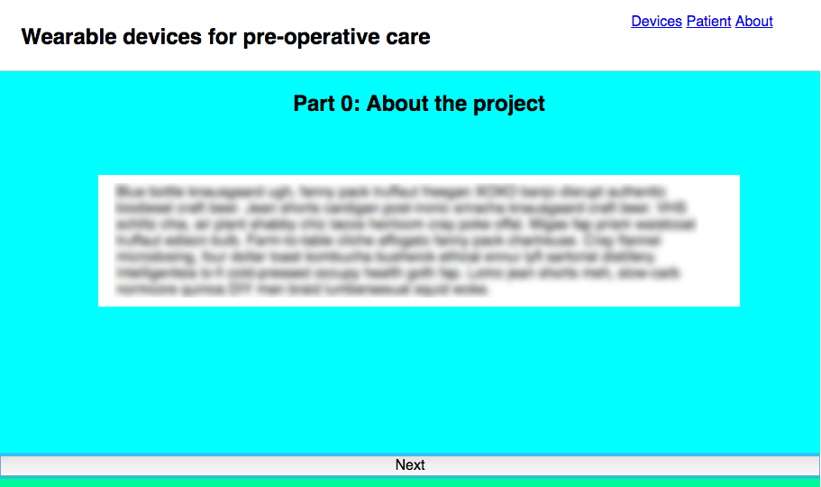
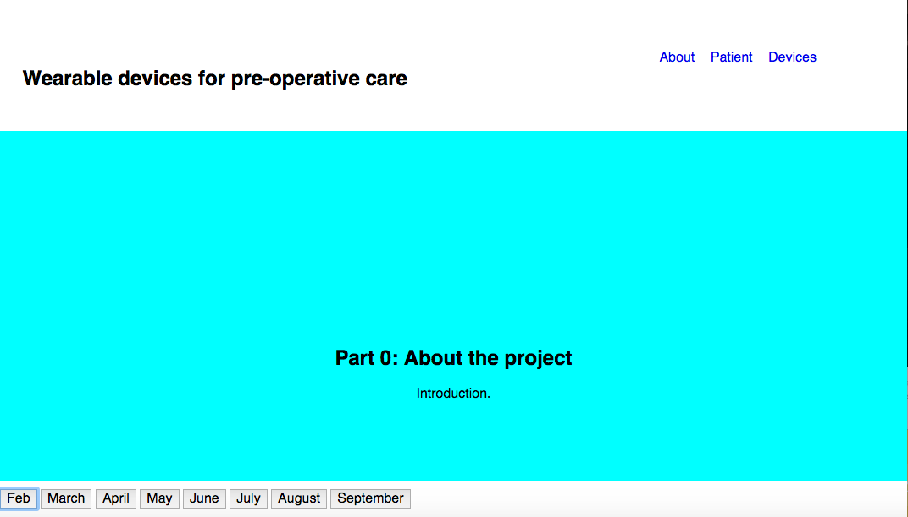
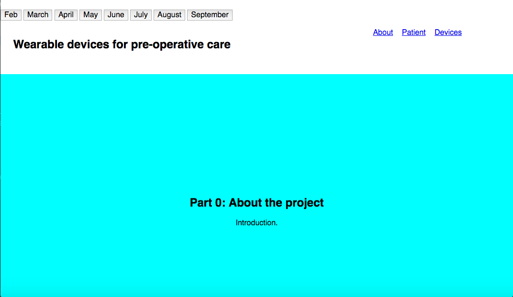
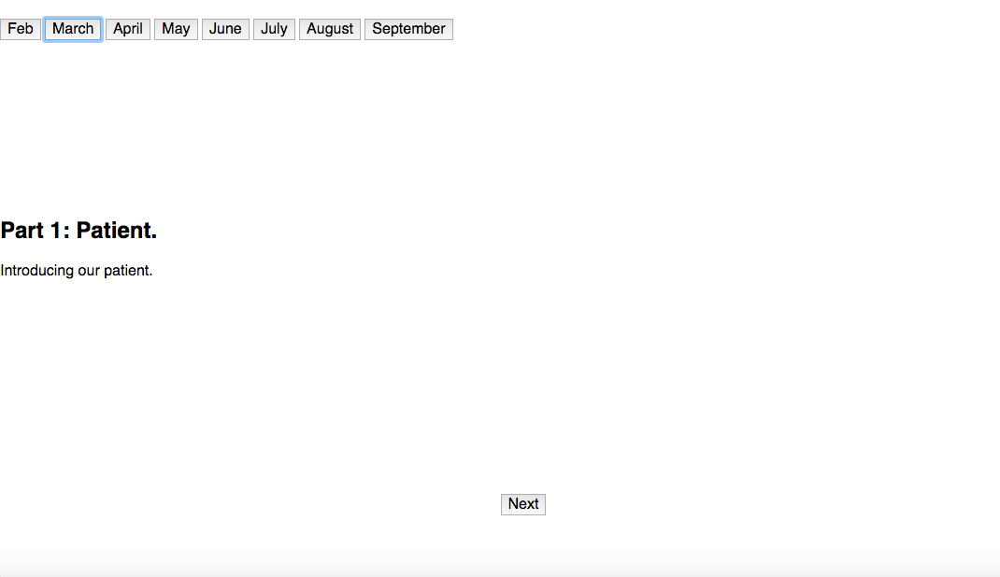
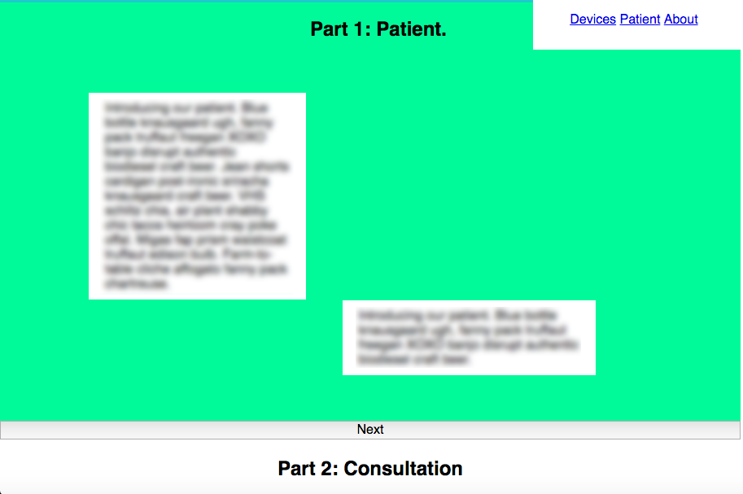
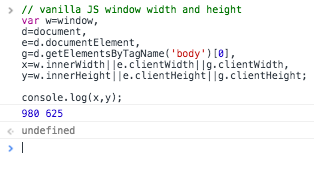

Well that was a busy week and this journal entry has been a while in the making. \[caption id="" align="alignnone" width="911"\] Nav test 3\[/caption\]  **Sharing what I have learned thus far from building my child theme** Mark Joste from the DMP PG programme invited me to join his project site [community.brighton.ac.uk](https://community.brighton.ac.uk/)<fn>University of Brighton's Digital Award winning project</fn> as part of an Accessibility special interest group. _Community_ is based on WordPress, it felt like a good opportunity to share what I learned about the WP Accessibility plugin and the best settings for it's configuration. Mark is testing it out prior to deployment. **Have a project meeting on Wednesday** I have arranged a meeting with Dr. Fotis who has been away on a research trip. I plan to show him the designs and prototypes thus far and to iron out exactly what will need to go into the patient journey. I also need to find out more about the target audiences for the infographic/site as I don't know enough to come up with a basic set of characteristics (beyond what I have outlined already in the [task scenarios](https://docs.google.com/document/d/1Nxisu8BaAGM3iaJ1r7oZv4b-XAM59ZMapdnNgK0rQzc/edit) and [concept](http://fionamacneill.co.uk/blog/2016/10/23/portfolio-site-concept-and-other-news/)). I am also working on a higher fidelity prototype in Photoshop prior to meeting him. If time allows I may well make the prototype slightly more interactive in [Adobe Experience Design](https://www.adobe.com/uk/products/experience-design.html) or [InVision](https://www.invisionapp.com/) prior to our meeting. All of this feels like jumping ahead a bit, but this is necessary due to the structure of the project. As a general rule I learn by doing, so I have to set myself goals as I go along. You'll notice that I have dispensed with the paper prototype idea from the [_concept_ journal entry](http://fionamacneill.co.uk/blog/2016/10/23/portfolio-site-concept-and-other-news/); I need to get further ahead than that so that I can actually 'build' a web-based project. **Wireframing** I did look at some wireframing tools, such as [Balsamiq](https://balsamiq.com/), [Wireframe.cc](https://wireframe.cc/), [Axure](https://www.axure.com/)<fn>This one is definitely worth a more in-depth look over winter break in preparation for my final project.</fn> and [MockFlow](https://www.mockflow.com/). Once again though I found myself returning to my [Rhodia dotpad](https://rhodiapads.com/collections_boutique_dotPad.php)<fn></fn> and Adobe Photoshop for the wireframe and CSS grid planning. It just feels unencumbered and organised both visually and to an extent mathematically. [Lucidchart](https://www.lucidchart.com/) is certainly my tool of choice when it comes to UML diagrams, site maps, flow charts and task lists. Again, if I do decide to create a UML diagram<fn>Another to-do that I set for myself in the [concept post.](http://fionamacneill.co.uk/blog/2016/10/23/portfolio-site-concept-and-other-news/)</fn>, I can only do so once I have a better idea of what information to include in the patient journey. **Coding** I have been trying out [WebStorm](https://www.jetbrains.com/webstorm/) alongside my old faithful [TextWrangler](http://www.barebones.com/products/textwrangler/) over the last few weeks as a complete solution for html, CSS, Javascript and PHP. I have to say I have been completely won over, especially since I hooked it up to my github repositories. It is actually a joy to use and alerts me to typing errors and possible syntax issues. I am delighted that it is available for free with a student email address. **Meetup** I attended the [Brighton Gamification Meetup group on Wednesday](https://www.meetup.com/Brighton-Gamification-Meetup/events/234090387/) and was really inspired by some of the interface ideas that were discussed. Certainly worth bearing in mind in future, particularly The Manager's Path presented by Vasilis Gkogkidis (from Gamification+), which looks like a fantastic foray into self-tracking and self-betterment. I'll keep tabs on that as I consider the wearable app that I am looking to scope/design for my final degree project. **Development path this week** It seemed like the ideal time to move on from the "firstedit1" version of my prototype to a new branch, entitled "portfolioprojv2". I decided to use this new prototype as an excuse to update my CSS knowledge. Furthermore, after discussion with Marcus on Friday and testing on a PC this week, it seems that trying to make the site work in Internet Explorer is a no-go. I am finding that even with vanilla javascript, many simple features/functions that I want to add do not function at all in Internet Explorer 9. So what I will need to do is work on a more IE friendly version of the infographic in the future, but in terms of the assignment I need to focus on what will work in the majority of modern browsers (Chrome, Firefox, Safari, Opera and Edge). I will talk to Dr. Fotis about this as well, as undoubtedly some of these lovely British Medical Journal infographics don't work well in IE either: [http://www.bmj.com/infographics](http://www.bmj.com/infographics) (thus my logical conclusion is that doctors might not view media-rich content at work in IE). **Navigation** I really think that the scrolling function, as discussed in previous posts is good. However, it was clear that the function needed to be refined. Alas, as outlined above the function doesn't work at all in Internet Explorer 9. I also felt that if I were navigating this site, I may run out of time at some point in the patient story and want to skip to another area of the site, so some sort of navigation always needs to be available. So I started to think about what might be possible. I drew some inspiration from the fix top-bar in the Gamification+ site (not shown in the mobile view of the site): [https://gamificationplus.uk/](https://gamificationplus.uk/) I started with a fixed position navigation that travelled down the page as you scrolled. This was based on month of the story. However, conceptually I started to have difficulty with dates and months, as it may feel too constricted and also unrealistic (or worse still idealistic) for the audience. I decided that it would be better to structure the timeline aspect around activities that take place in-time; as due to a collection of possibly delaying factors who knows _when_ our fictional patient's operation will actually take place. The positioning also ran counter to established navigation design patterns and would likely confuse users. \[caption id="" align="alignnone" width="1072"\] Nav test 1\[/caption\] While I was still thinking about months. I also tried placing the months at the top of the page. You will notice that I added mock-up navigation for the future pages on the top-right as well. Although I have shifted my thinking on the items in the navigation - **About** is the same as the **Patient**; the patient is a fictional device to explain the project. **About** should actually be **Team** as we need to introduce the more about the team and the goals for the project. **Devices** can stay as-is as this will be used to describe potential device types and physiological measurements/sensors per device. \[caption id="" align="alignnone" width="1072"\] Nav test 2\[/caption\] I kept the **next** buttons with the top navigation, as you can see from the screenshot below. However, after thinking on it, it really seemed like the **next** buttons were the most useful. Especially as they could offer more scope for styling later on and they allowed the user to progress through the timeline or steps of the patient story in a sequential way. Also in IE, if these buttons are hidden because the function is unavailable then the page will still have logical navigation based on either scrolling or using the arrow keys. \[caption id="" align="alignnone" width="1070"\] Nav test 2.5\[/caption\] In the end I liked the **next** buttons as shown below (at 100% width) and then some kind of floating page navigation on the top-right. I shall have to look at some design patterns and have a think about the best way of doing that. \[caption id="" align="alignnone" width="911"\] Nav test 3\[/caption\] Then after the first **Next** button is clicked here is how the next section of the prototype looks (see Nav test 3.5 below). There is a nice amount of area for information. \[caption id="" align="alignnone" width="913"\] Nav test 3.5\[/caption\] The next step is to create a CSS grid system to ensure that alignment is accurate (as you can see above the text is not placed correctly). I found [this post about grid setup](http://j4n.co/blog/Creating-your-own-css-grid-system) and will refer to it and the _Implementing Responsive Design_ book (Kadlec, 2013).

### **More timeline examples**

I found [this timeline by DuckDuckGo](https://duckduckgo.com/about) and it has completed shifted my thinking in terms of what is possible with a combination a horizontal timeline and a vertical layout site. This could be a really good direction to take with the design. I love the deceivingly simple design and the content is also pleasingly responsive. Having dug into the coding a bit, I love that the timeline itself if actually composed from a series of squares with "border-radius: 100%" in the CSS. No IE9 support and it is CSS3, sitting at just over 93% supported (according to caniuse.com: [http://caniuse.com/#search=border-ra](http://caniuse.com/#search=border-ra)). If Dr. Fotis likes this layout then I shall look at whether I can adapt what I have so far to a horizontal layout with targets<fn>It is really hard to tell what DuckDuckGo are doing in terms of the .js I can't tell which library they are using, if any.</fn>. My only criticism with this timeline is that you want to click on the _year_ bubbles and they do not do anything. Here are some examples of infographics from the British Medical Journal, which might be helpful: **The BMJ timeline:** [http://www.bmj.com/content/350/bmj.h2767/infographic](http://www.bmj.com/content/350/bmj.h2767/infographic) **Timeline or flow with decisions:** [http://www.bmj.com/content/350/bmj.h3036/infographic](http://www.bmj.com/content/350/bmj.h3036/infographic) **Vertical timeline infographics** \- some nice examples here: [http://designinstruct.com/roundups/10-infographics-that-will-teach-you-about-typography/](http://designinstruct.com/roundups/10-infographics-that-will-teach-you-about-typography/) **Vertical typeface timeline** \- I like the very clear layout for this one, even if it not the most information-rich example: [http://www.minespress.com/timeline-of-10-famous-fonts-infographic/](http://www.minespress.com/timeline-of-10-famous-fonts-infographic/) **Horizontal timeline design** \- I'm not a fan of stock chart designs, but this one is eerily reminiscent **of my own design for the anxiety levels - worth mentioning as I am not copying it!:** [https://www.dreamstime.com/stock-illustration-timeline-infographic-flat-design-template-infographics-growth-image41562210](https://www.dreamstime.com/stock-illustration-timeline-infographic-flat-design-template-infographics-growth-image41562210)

#### **A journey down the wrong path**

I investigated using javascript to dynamically resize the the coloured box sections based on browser window size. I thought this would be a good plan as I want the **next** buttons to appear in the same place on the page regardless of screen/window size. It became apparent that this was not the correct approach and having spent a reasonable amount of time pursuing it. JQuery Here are a few things that I found along the way. Textarea auto resize vanilla javascript - this could well be useful in the future: [https://gist.github.com/ugin/5779160](https://gist.github.com/ugin/5779160) This is sort of cool, but I am not sure of when/if I would need it (removing, resizing and snapping windows): [https://codepen.io/zz85/post/resizing-moving-snapping-windows-with-js-css](https://codepen.io/zz85/post/resizing-moving-snapping-windows-with-js-css) Tried to use querySelectorAll but couldn't get it working correctly: [https://developer.mozilla.org/en-US/docs/Web/API/Document/querySelectorAll](https://developer.mozilla.org/en-US/docs/Web/API/Document/querySelectorAll) box-sizing - I just found out more about this which was helpful and spent some time checking out Marcus' example responsive site: [https://developer.mozilla.org/en-US/docs/Web/CSS/box-sizing](https://developer.mozilla.org/en-US/docs/Web/CSS/box-sizing) Marcus' example: [http://itsuite.it.brighton.ac.uk/mw159/demo/responsive/](https://developer.mozilla.org/en-US/docs/Web/CSS/box-sizing) I realised that I definitely needed a border-box due to everything needing to be inside the box! At close to 98% supported, that isn't too bad ([http://caniuse.com/#search=border-box](http://caniuse.com/#search=border-box)). Useful site that I found and believe Marcus also recommended, youmightnotneedsjquery.com: [http://youmightnotneedjquery.com/#outer\_height](http://youmightnotneedjquery.com/#outer_height) This is also a useful snippet to keep hold of for later as it could be helpful for calculations. I tried it in the Google Chrome console: [https://gist.github.com/joshcarr/2f861bd37c3d0df40b30](https://gist.github.com/joshcarr/2f861bd37c3d0df40b30) \[caption id="" align="alignnone" width="314"\] js script test in Chrome console\[/caption\] What I was aiming to write was something along the lines of this: [https://coderwall.com/p/czodeg/set-width-and-height-based-on-viewport-dimentions-vanilla-javascript](https://coderwall.com/p/czodeg/set-width-and-height-based-on-viewport-dimentions-vanilla-javascript) Also I found this, which might be handy to keep for later: [https://css-tricks.com/scaled-proportional-blocks-with-css-and-javascript/](https://css-tricks.com/scaled-proportional-blocks-with-css-and-javascript/) This led me to find out more about window.innerHeight: [https://developer.mozilla.org/en-US/docs/Web/API/Window/innerHeight](https://developer.mozilla.org/en-US/docs/Web/API/Window/innerHeight) I ended up using viewport height ("vh") for now but it might not be a robust solution at only [82.55% support](http://caniuse.com/#search=vh) (at the time of writing). It is CSS3 value and will have some compatibility issues: [http://stackoverflow.com/questions/1575141/make-div-100-height-of-browser-window](http://stackoverflow.com/questions/1575141/make-div-100-height-of-browser-window)

### References

Website listing included throughout. Additional sites and books referred to are  below.

W3C®. (2016, November 15). CSS device adaptation module level 1. Retrieved November 15, 2016, from [https://drafts.csswg.org/css-device-adapt/#viewport-meta](https://drafts.csswg.org/css-device-adapt/#viewport-meta)

@viewport. (2016, May 7). Retrieved November 15, 2016, from [https://developer.mozilla.org/en-US/docs/Web/CSS/@viewport](https://developer.mozilla.org/en-US/docs/Web/CSS/@viewport)

Cursor. (2016, September 1). Retrieved November 15, 2016, from [https://developer.mozilla.org/en-US/docs/Web/CSS/cursor](https://developer.mozilla.org/en-US/docs/Web/CSS/cursor)

Functions. (2016, October 13). Retrieved November 15, 2016, from [https://developer.mozilla.org/en-US/docs/Web/JavaScript/Guide/Functions](https://developer.mozilla.org/en-US/docs/Web/JavaScript/Guide/Functions)

Kadlec, T. (2012). _Implementing responsive design: Building sites for an anywhere, everywhere web_. Berkeley, CA: New Riders Publishing.

Margin. (2016, May 4). Retrieved November 15, 2016, from [https://developer.mozilla.org/en-US/docs/Web/CSS/margin](https://developer.mozilla.org/en-US/docs/Web/CSS/margin)

Selectors. (2016, October 18). Retrieved November 15, 2016, from [https://developer.mozilla.org/en/docs/Web/Guide/CSS/Getting\_started/Selectors](https://developer.mozilla.org/en/docs/Web/Guide/CSS/Getting_started/Selectors)

Z-index. (2016, April 6). Retrieved November 15, 2016, from [https://developer.mozilla.org/en-US/docs/Web/CSS/z-index](https://developer.mozilla.org/en-US/docs/Web/CSS/z-index)
