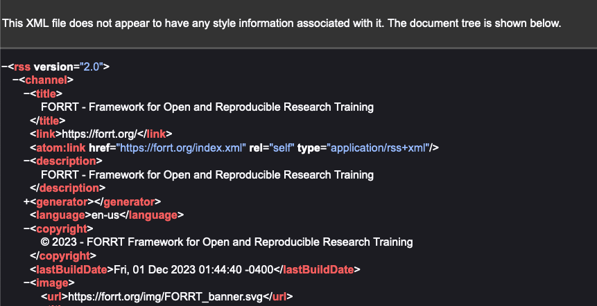
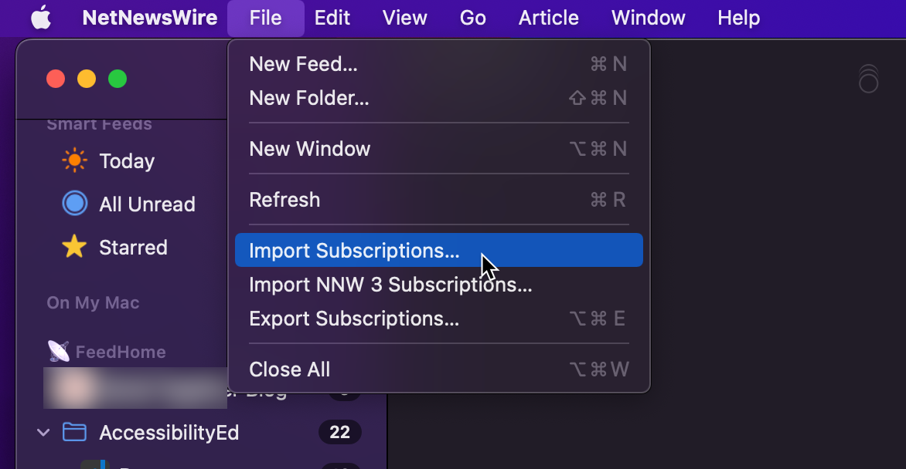
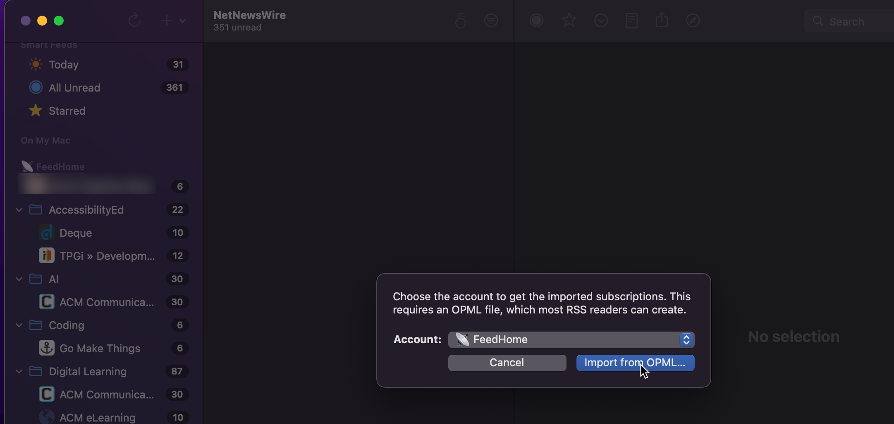
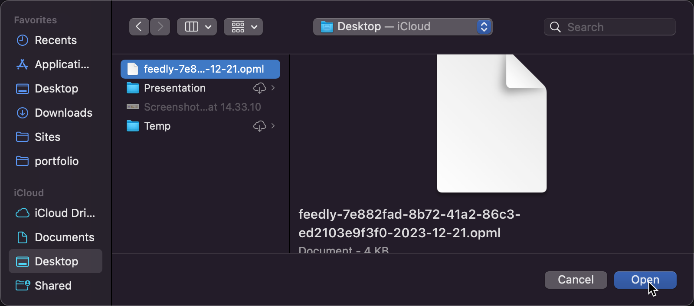

---
title: "Falling back in love with the humble RSS feed"
subtitle: "Sometimes old tech still has merit"
summary: "A quick reflection on RSS feeds and the merits of RSS curation"
authors: []
tags: 
- "RSS" 
- "Really Simple Syndication" 
- "podcasts" 
- "blogging" 
- "curation" 
- "reading" 
- "writing"
categories: 
- "ux"
- "reflection"
- "practice"
date: 2023-12-24T11:30:00
lastmod: 
featured: false
draft: false

# Featured image
# To use, add an image named `featured.jpg/png` to your page's folder.
# Focal points: Smart, Center, TopLeft, Top, TopRight, Left, Right, BottomLeft, Bottom, BottomRight.
image:
  caption: "RSS Humbie Pie - AI generated created using Midjourney"
  focal_point: "Smart"
  preview_only: false

# Projects (optional).
#   Associate this post with one or more of your projects.
#   Simply enter your project's folder or file name without extension.
#   E.g. `projects = ["internal-project"]` references `content/project/deep-learning/index.md`.
#   Otherwise, set `projects = []`.
projects: [] 
--- 

## Kudos

This blog post is inspired by a tip from [Al Power](https://www.alpower.com/), who suggested that I check out [NetNewsWire app](https://netnewswire.com/) (Mac, iPhone, iPad). Read Al's [post at his blog for more details](https://www.alpower.com/blog/my-news-feed-reader-setup/).  

## A history of my relationship with RSS

### My first blog

My relationship with blogging and frontend web development began in 2005 when I started my first blog, *The Anatomy of an Armpit*. The blog, which was on [Google's Blogger platform](https://en.wikipedia.org/wiki/Blogger_(service)), recounted my trials and tribulations while stuck in an area of Scotland I wasn't fond of - as I was a youth at the time you can probably imagine the content (*think* ill-advised Tumblr-style rants). Regardless, I owe a lot to my first blog which got me interested in HTML, CSS, frontend web design, accessibility, and usability - interests that I have to this very day. It also helped me gain an understanding of [RSS or Really Simple Syndication](https://en.wikipedia.org/wiki/RSS), which at that time was the main way to stay up-to-date on your favourite bloggers' content. At first this was via humble browser tools and bookmarking, then via the long defunct, [Google Reader](https://en.wikipedia.org/wiki/Google_Reader). 

### My first podcast

Then in 2006 I got into podcasting, a technology reliant on RSS metadata and distribution. To say I was ahead of the curve on this would be an understatement. At that time hosting a podcast was a painfully slow process and I used one of the more user-friendly tools, [Libsyn](https://libsyn.com/) or Liberated Syndication. It would take 2 to 4 hours to upload one episode to your site host only to find out that the audio artifacting was so bad, you'd have to start again. I had many an all-nighter for the love of my show, *Motif Radio* (you can still see the [snapshots on the Internet Archive WayBack Machine](https://web.archive.org/web/20060909220813/http://motifradio.libsyn.com:80/)). *Motif Radio* was inspired by London arts radio station, [ResonanceFM](https://www.resonancefm.com/) and was eclectic to say the least. 

*Motif Radio* cooincided with one of the most creative and productive periods in my life. It was also a time of hardship and so much of that difficulty fed into my passion for creating the podcast. One of my favourite memories was a successful episode release, it finished uploading by 11.30 pm which was highly unusual. I was so elated that my partner and I went to the midnight showing of *[V for Vendetta](https://www.imdb.com/title/tt0434409/?ref_=fn_al_tt_1)* at the Mall of America to celebrate. Even though it isn't the best film, it will always have a place in my heart for that reason. 

### Podcasts - a longterm obsession!

My obsession with podcasts continues to this day and I'm an avid follower of about thirty of them, funding my favourite creators on Patreon. I have often thought about resurrecting *Motif Radio*, which ended in 2007, especially as now, after many years, I have the audio kit to do so. Something to consider on as we go into 2024, although it would need to come back under a new name as there is now another [Motif Radio](https://motif-radio.com/) which specialises in urban music. In the meantime I have enjoyed my guest hosting spots on the [Ladies that UX podcast in English](https://podcasters.spotify.com/pod/show/ltux-in-english). 

### So why the return to RSS after all this time? 

I was working on some frontend web development at my job and I setup a new RSS feed as part of that. While configuring the feed I fell in love once again with the simplicity, the clarity of information, and the potential for curatorial serendipity. What do I mean by 'curatorial serendipity'? Well in the era of [Medium](https://medium.com/) and its ilk, so much of what I consume is curated by algorithms on my behalf. On the one hand this is helpful, as content is rich and time is short, but what is being filtered out? Am I missing the other books on the shelf which might be more interesting than the book I *think* I need? Or to continue this library-inspired analogy, those other books might be more interesting than the book the library catalogue *thinks* I need. I was yearning for a bit more control to follow the feeds that I really care about - enter [NetNewsWire](https://netnewswire.com/) by [Brent Simmons](https://github.com/Ranchero-Software) which is my new favourite. An RSS curation app which allows me to setup up my feeds, sync them to iCloud, and access them on all my devices. More on that below. 

If you would like to subscribe to this blog using RSS, here is the URL you need. 
```html 
<!-- xml feed for this blog-->
https://www.fionamacneill.co.uk/index.xml
``` 

To find out the RSS feed for just about any site, including your favourite content on Medium, check out this helpful [post on Zapier blog](https://zapier.com/blog/how-to-find-rss-feed-url/). 

As an added tip for sites using static site generators like Hugo, a good rule to follow is to take the root of the site and add 'index.xml'. So I'd start by looking at the site footer and then the page source to identify which generator is in use. Then try adding '/index.xml' at the end and see if you get a page that looks like a feed. 

E.g., 

Take the example of one of my favourite websites about retractions in research, *[FORRT - Framework for Open and Reproducible Research Training](https://forrt.org/reversals/)*. 


I take a look at the footer of the site...
 

I then try adding /index.xml to the root web address...

```html 
<!--The website https://forrt.org/reversals/ becomes...-->
https://forrt.org/index.xml
```

 

Bingo! There is the feed that I want for NetNewsWire.

<br>

-----

### Festive giving aside...

As as aside, this post is clearly indepted to both [Wikipedia](https://donate.wikimedia.org/w/index.php?title=Special:LandingPage&country=GB&uselang=en&utm_medium=donatewiki_page&utm_source=Ways_to_Give&utm_campaign=donate_now_btn) and [The Internet Archive](https://archive.org/donate). I note that they both organisations have active fund-drives for the end of year. I will be giving to both as these types of organisations are important for preserving knowledge and transient digital artefacts. In a web which is progressively less free, I give back where I can. 

----- 

<br>

### RSS - my *new* old love 

So having now moved my feeds from Feedly, which I had a) forgotten about, and b) got annoyed with its paywall limitations - I am now once again enjoying my old-school blog consumption. My only slight gripe is that some of my favourite sites (ahem, NNG) do not have RSS feeds for their articles. I might start asking nicely as I feel it is time for an RSS comeback! 

<br>

## Bonus tutorial - how I moved from Feedly 

I started in NetNewsWire by setting up my feed account in my iCloud storage. As NetNewsWire accepts emoji's I couldn't resist including a wee satellite emoji in my account name. Then I completed the following steps to migrate my RSS feeds from Feedly in OPML format. 

1. Go to your profile options on the bottom-left of Feedly (your avatar or the default placeholder). 
2. Select 'Organize Feeds'. 


3. Click on the arrow on the right-hand side (great signposting here, anyone would think they might not want you to export your feeds...). 


4. Download your Feedly OPML file. 


5. Then open NetNewsWire and go to File > Import Subscriptions in the top menu bar. 



6. Select your feed account and then select 'Import from OPML'. 



7. Select the Feedly OPML from your computer. 



8. Then reorganise your feeds into an many folders as you like! 

## Housekeeping 

This will be my last blog post for a little while as I will be updating this site. This will include an updated theme, some backend updates, and new case studies. I'll also be finally moving some of my artefacts from the *temporary* Notion page (temporary for two years...) to this site. 